<p align="center"></p>

Security assessment for Active Directory, Microsoft Entra ID and Microsoft 365. Benchmark runs 800+ checks across on-premises Active Directory, AD Certificate Services, domain controllers, Windows servers and workstations, Entra ID, Intune, Exchange Online, SharePoint Online, Teams, Purview, Defender and Azure. It maps attack paths into Tier 0, hunts for signs of compromise in event and sign-in logs, and produces executive, technical and remediation reports.

It is a small Windows desktop app. It needs no server, no agent and no cloud service of its own: assessments are plain folders on your computer.

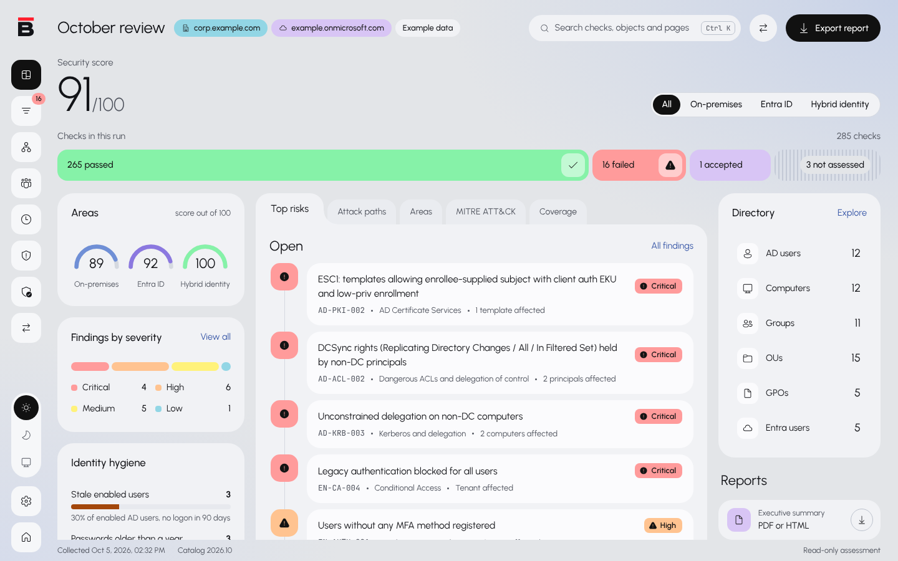

## Features

- **On-premises Active Directory:** accounts and passwords, privileged groups, delegation and ACLs, Kerberos, GPOs, trusts, replication, AD CS templates and ESC paths, domain controller hardening, LAPS, and event-log threat hunting.
- **Microsoft cloud:** Entra ID users, roles, PIM, Conditional Access, applications and consent, devices, Intune, Exchange Online, SharePoint, Teams, Purview, Defender XDR and Azure resources.
- **Hybrid:** Entra Connect, AD FS, pass-through authentication, and the paths that lead from the cloud into on-premises Tier 0 and back.
- **Attack paths:** a relationship graph showing the shortest routes to Domain Admins and other Tier 0 objects.
- **Reports:** executive summary, technical report, remediation plan and change report, as PDF, HTML or Excel, plus JSON, CSV and SARIF for other tools. Reports can carry your branding and can be pseudonymized.
- **Over time:** compare two runs, record accepted risks with an expiry date, and follow the score from one assessment to the next.
- **Command line:** analyze bundles and write reports from scripts or scheduled tasks.

### Findings

Every failed check lists the affected objects, the evidence, how an attacker would use it, the remediation steps and how to verify the fix, with a CVSS score and MITRE ATT&CK mapping.

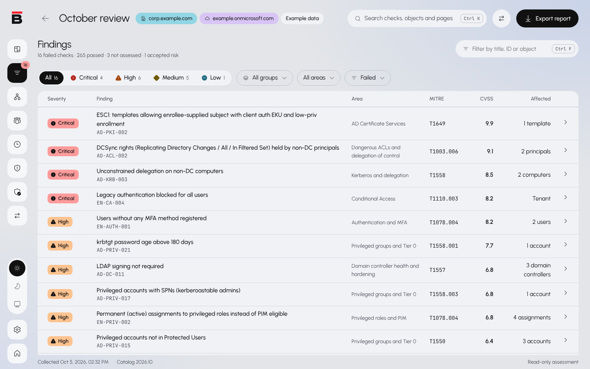

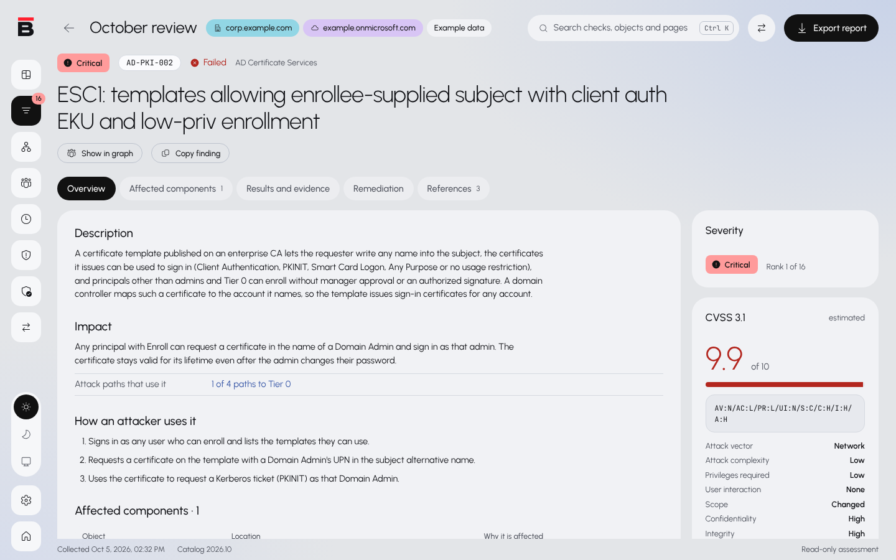

### Attack paths

Ready-made questions show where privilege can escalate toward Tier 0, and the relationship graph draws every route, shortest first.

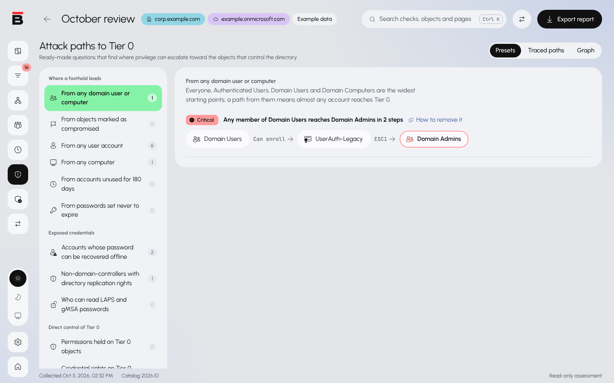

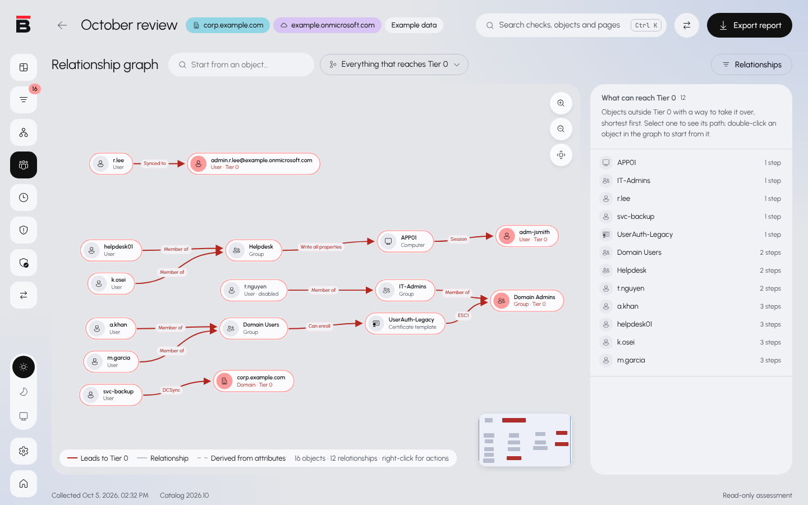

### Directory and account ages

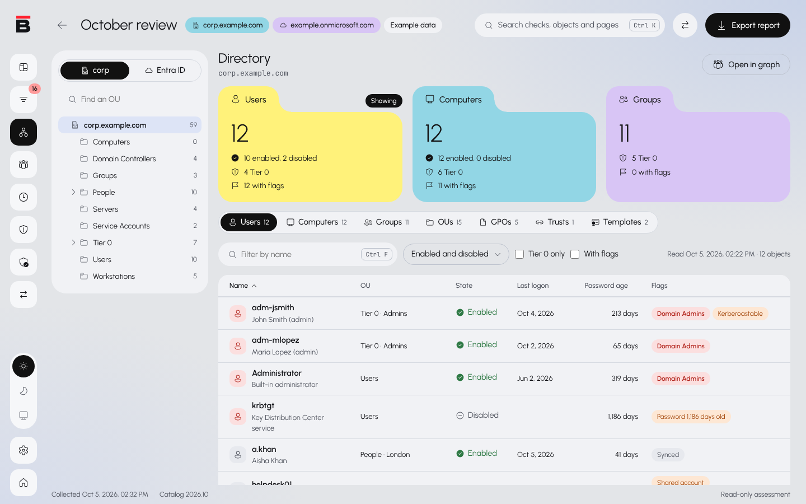

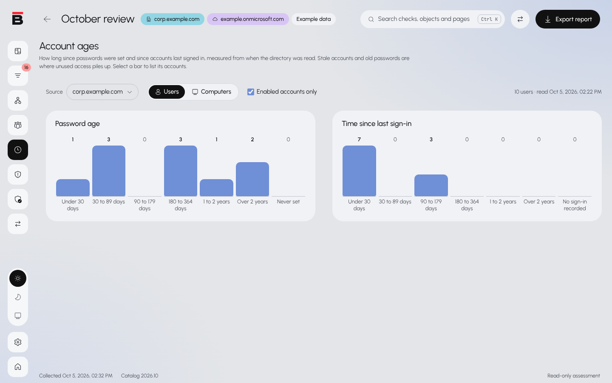

### Compliance and progress

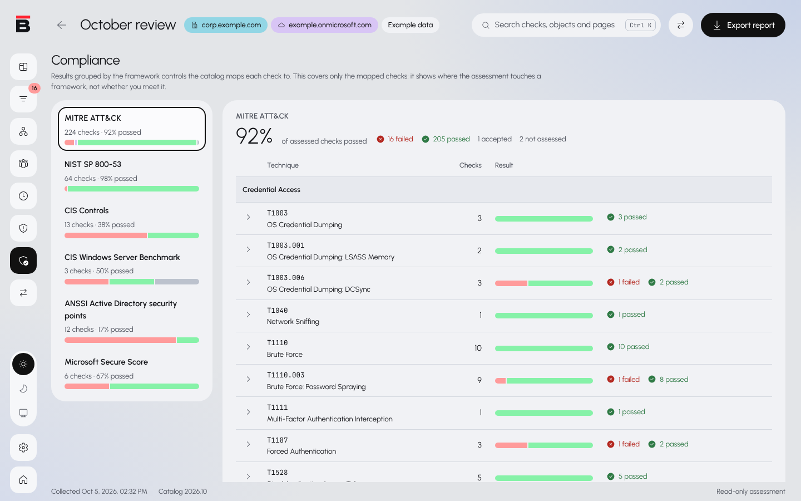

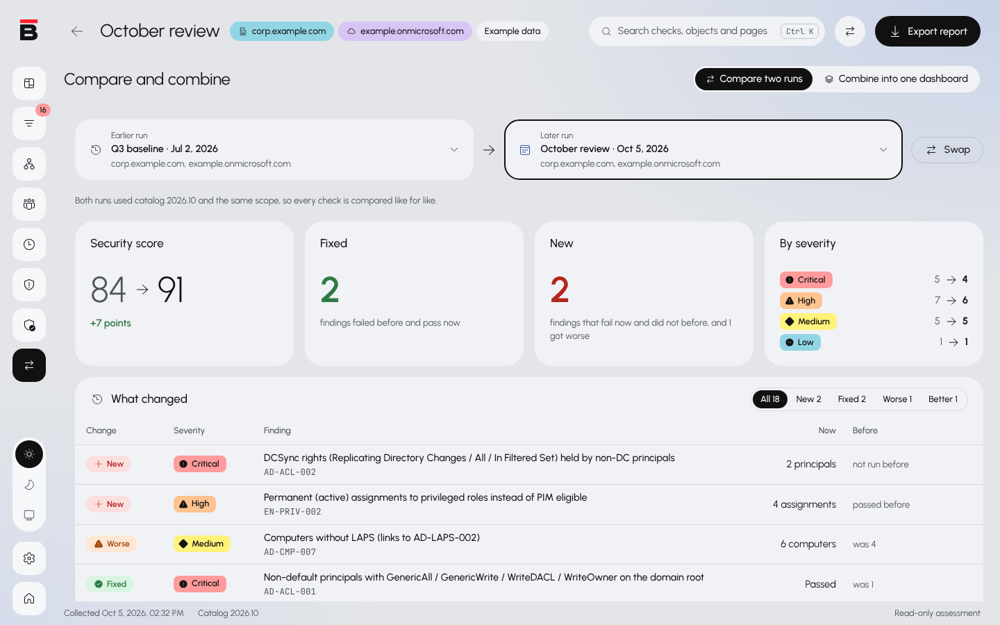

### Reports

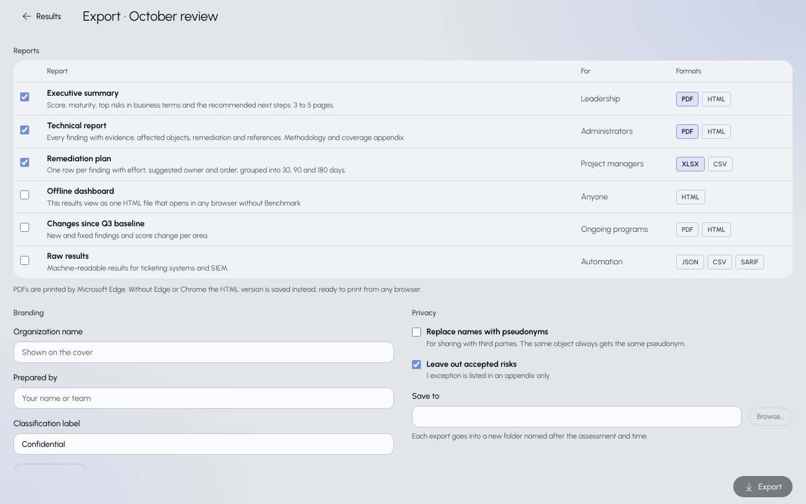

### Light and dark

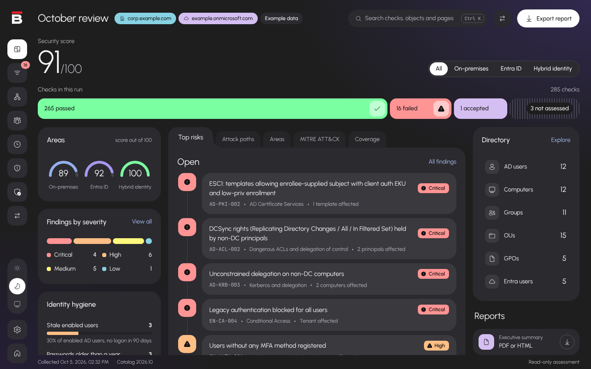

## Install

Download the latest installer (`Benchmark_<version>_x64_en-US.msi`) or the portable ZIP from the [Releases](../../releases) page. Each release lists the SHA-256 hash of every file.

Requirements:

- Windows 10 or 11, or Windows Server 2016 or later, with WebView2 (already part of current Windows).
- Windows PowerShell 5.1, included with Windows.
- For PDF reports, Microsoft Edge (included with Windows) or Google Chrome.
- For Exchange Online, SharePoint, Teams and Purview, Microsoft's own PowerShell modules: ExchangeOnlineManagement, Microsoft.Online.SharePoint.PowerShell and MicrosoftTeams. Benchmark tells you when one is missing.

## Running an assessment

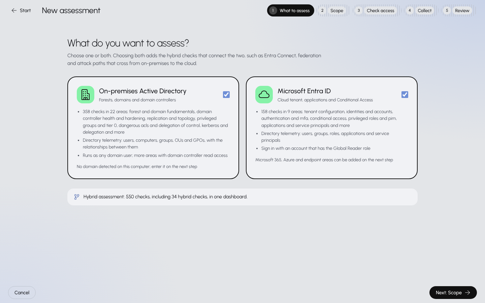

1. Start Benchmark and choose **New assessment**.
2. Enter the Active Directory domain, the Microsoft 365 tenant (for example `contoso.onmicrosoft.com`), or both, and choose the areas to assess.
3. Benchmark checks what the current account can read and shows anything missing before it starts.
4. For the cloud, sign in with a **work or school account in that tenant** when the browser opens. Personal Microsoft accounts (outlook.com, hotmail.com) have no tenant to assess.
5. When collection finishes, open the results, then write reports from **Export**.

### Accounts and permissions

| Scope | Recommended account |
|---|---|
| Active Directory | A domain user reads most of the directory. Domain controller configuration, event logs and audit settings (SACLs) need a member of Domain Admins, or an account delegated to read them. Domain controllers and endpoints are read over WinRM. |
| Microsoft Entra ID and Microsoft 365 | **Global Reader**, plus **Security Reader** for Defender. The first sign-in asks an administrator to approve the app's permissions. |
| Azure | **Reader** on the subscriptions to assess. |

Areas that need a licence the tenant does not have (for example Intune, or Entra ID P2 for PIM and access reviews) show as **Not licensed**, and the checks that depend on them are reported as not assessed, with the reason.

### Collecting on another computer

The collectors can run without the app, for example on a domain controller or a server with no desktop. `-Bundle` packs the output into a .zip; copy it to the computer with the app and choose **Open bundle** on the start screen.

```powershell
.\Invoke-DCACollect.ps1 -Domain corp.example.com -OutDir C:\Temp\bench -Sources ldap,sysvol,dc-remote,dc-events -Bundle C:\Temp\bench-corp.zip
```

### Command line

Pipe to `Out-Host` so PowerShell waits for the app; `Benchmark.exe help` lists every option.

```powershell
Benchmark.exe analyze C:\Temp\bench-corp.zip | Out-Host
Benchmark.exe export "$env:LOCALAPPDATA\Benchmark\Assessments\20261006-0930-corp.example.com" --out D:\Reports --reports executive,remediation --formats pdf,xlsx | Out-Host
Benchmark.exe list | Out-Host
```

### Keyboard

`Ctrl+K` opens a palette that jumps to any page, area, check or object. `Ctrl+F` goes to the search box of the current screen. In tables, the arrow keys, Home and End move between rows and Enter opens one. `Esc` leaves a finding or object page. Windows high-contrast themes are supported.

## How it works

- **Collectors** (`collectors/`) are PowerShell scripts that query Active Directory over LDAP, domain controllers and endpoints over WinRM, and Microsoft's cloud through Microsoft Graph, Azure Resource Manager and Microsoft's own PowerShell modules. They only query: CI rejects any collector change that could modify a system (`tools/Test-CollectorsReadOnly.ps1`).
- **The analysis** (`crates/dca-core/`) is a Rust library that turns the collected data into results using the check catalog in `checks/`. Each check has a description, impact, remediation steps, a way to verify the fix, and references (MITRE ATT&CK, CIS, ANSSI, Microsoft) where they apply.
- **The app** (`app/`) is a Svelte interface in a Tauri shell.

Nothing is sent anywhere except the queries to your own directory and tenant. Secret values are never collected (no password hashes, BitLocker keys or LAPS passwords), only who can read them.

The screenshots show the example assessments that ship in `fixtures/`, against reserved example domains, so no real organization's data appears.

## Building from source

Requirements: Rust (stable), Node.js 22, and on Windows the [Tauri prerequisites](https://tauri.app/start/prerequisites/).

```powershell
cd app
npm ci
npx tauri dev      # run the desktop app
npx tauri build    # build the MSI into target/release/bundle/msi
```

Tests and checks, as CI runs them:

```powershell
cargo test -p dca-core                         # analysis unit tests, including catalog validation
cd app; npm run check                          # Svelte and TypeScript checks
cd app; node tests/screenshots.mjs             # retake the README screenshots (after npm run build and preview-data)
pwsh ./tools/Test-CollectorsReadOnly.ps1       # collectors only query
pwsh ./tools/Test-CollectorHelpers.ps1         # collector helper functions
node tools/check-graph-schema.mjs              # cloud requests against Microsoft's published Graph schema
```

CI also runs the collectors against a real Samba Active Directory domain and a Windows Server with Certificate Services, and builds and tests the installer, including PDF export.

## Releasing

Push a version tag (for example `git tag v0.1.0 && git push origin v0.1.0`). CI builds the installer and the portable ZIP, and publishes them with their SHA-256 hashes as a GitHub release. The tag must match the version in `Cargo.toml`.

## Licence

Benchmark is **free for internal use**: any organization may use it to assess its own environment, under the [PolyForm Internal Use License 1.0.0](LICENSE).

Consultants, auditors, penetration testers and managed service providers who use Benchmark for their clients, and anyone reselling, hosting or redistributing it, need a **commercial licence**. See [COMMERCIAL-LICENSE.md](COMMERCIAL-LICENSE.md).

Copyright (c) 2026 Kod-Dot. Third-party components keep their own licences, listed in [THIRD-PARTY-NOTICES.md](THIRD-PARTY-NOTICES.md).
